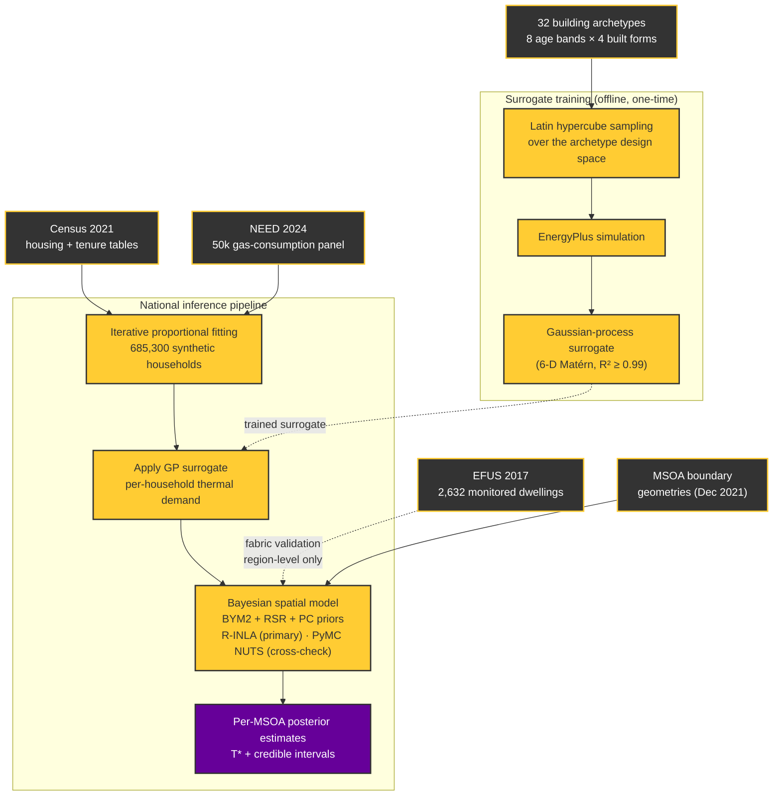

# Separating dwelling heat requirement from household energy rationing

[](../../actions/workflows/pytest.yml)
[](https://doi.org/10.5281/zenodo.21629036)
[](https://www.python.org/downloads/)
[](https://creativecommons.org/licenses/by-nc/4.0/)

A national-scale Bayesian model of England's housing stock that separates two
things routinely conflated in observed gas consumption:

- **the thermal energy a dwelling physically requires** — a function of its
  fabric, form and climate exposure, estimated by a Gaussian-process surrogate
  trained on EnergyPlus simulations; and
- **the energy its occupants actually use** — which, for households under
  financial pressure, can fall well below that requirement.

The gap between the two is a measure of *rationing* (self-disconnection,
under-heating) rather than of efficiency. Treating a low gas bill as evidence of
an efficient home is the inference error the model exists to avoid.

Estimation runs over all **6,853 English MSOAs** on a synthetic population of
**685,300 households**. The spatial term is a BYM2 field with penalised-complexity
priors, fitted under restricted spatial regression (RSR) so the spatial random
effect is projected onto the orthogonal complement of the income-deprivation
covariate — without which the spatial field absorbs the deprivation signal the
model is trying to measure.

> **Status.** Supports a manuscript submitted to *Energy and Buildings* (July
> 2026). Results are not peer-reviewed yet.

---

## Architecture



R-INLA is the primary engine: it fits the national model in ~200 s against
~2.5 h for the equivalent NUTS run, which is what makes prior-sensitivity and
holdout sweeps affordable. The PyMC NUTS path is retained as an independent
cross-check of the same posterior.

---

## Installation

Requires **Python 3.12**. R and INLA are optional — see
[Optional: R-INLA](#optional-r-inla).

```bash
git clone https://github.com/JulesBuckland/national-energy-bayesian-network.git
cd national-energy-bayesian-network
python -m venv .venv
source .venv/bin/activate      # Windows: .venv\Scripts\activate
pip install -r requirements-dev.txt
```

`requirements.txt` holds runtime dependencies with version floors;
`requirements-dev.txt` adds the test tooling; `requirements-lock.txt` pins the
full transitive tree used to produce the published results, for exact
reproduction.

### Verify the installation

```bash
pytest -ra
```

This needs no data. Tests that require either the licensed input fixtures or a
local R-INLA install skip themselves and state why — `-ra` lists them, so a
green run still shows exactly what was and was not exercised.

---

## Quick start on synthetic data

The pipeline's real inputs are large and partly licence-restricted, so the
repository ships a generator that produces synthetic inputs of the right shape
from a fixed seed:

```bash
python -m src.data.generate_synthetic_data
```

That writes a 680,000-household synthetic population and matching MSOA
confounders to `data/processed/`. It needs no external data and takes a few
seconds.

To then run inference you additionally need the MSOA boundary geometries, which
are openly licensed (see [Data](#data)), and a trained surrogate
(`data/processed/gp_emulator.pkl`). The CLI checks for every required input up
front and tells you which are missing and how to obtain each:

```bash
python -m src.cli.run_inference
```

For a fast approximate run on real data, set `PILOT_MODE=1`: it uses a
deliberately small draw count and writes to distinctly-suffixed files, stamped
with run metadata, so pilot output cannot be mistaken for a final result.

---

## Data

No input data is committed. Sizes below are the real national inputs.

| Input | Licence | How to obtain |
|---|---|---|
| MSOA boundaries (Dec 2021) | Open Government Licence v3 | [ONS Open Geography Portal](https://geoportal.statistics.gov.uk/) |
| Census 2021 housing and tenure (TS044, TS054) | Open Government Licence v3 | [ONS / Nomis](https://www.nomisweb.co.uk/) |
| NEED gas-consumption panel (50,000-property sample) | DESNZ end-user licence | [gov.uk NEED collection](https://www.gov.uk/government/collections/national-energy-efficiency-data-need-framework) |
| EFUS 2017 (SN 9434, ~2,632 monitored dwellings) | UK Data Service end-user licence | [UK Data Service](https://doi.org/10.5255/UKDA-SN-9434-1) |
| EnergyPlus LHS simulation results | Generated locally (~6.8 GB of runs) | `src/inference/lhs_sampler.py` then `src/physics/energyplus_batch.py` |

Place raw inputs under `data/raw/` following the paths in
`src/config/settings.py`, which is the single source of truth for every filename
the pipeline reads.

The test fixtures under `tests/fixtures/raw/` are derived from the NEED sample
and are therefore **not redistributable**. Regenerate them with
`python tests/generate_fixtures.py` once `data/raw/` is populated; the
data-dependent tests skip cleanly until then.

---

## Reproducing the published results

```bash
python -m src.inference.lhs_sampler          # LHS design over the archetype space
python -m src.physics.energyplus_batch       # EnergyPlus runs (long; needs EnergyPlus)
python -m src.inference.gp_emulator          # train and validate the GP surrogate
python -m src.data.population                # IPF synthetic population
python -m src.inference.inla.run_inla        # primary national fit (R-INLA)
```

`run_national_pipeline.ps1` wraps the population → surrogate → inference stages
on Windows. Pass `--inla` (default) or `--nuts` to select the inference engine. Validation and figure scripts live in `src/research/`:

| Script | Purpose |
|---|---|
| `regenerate_main_figures.py` | Manuscript figures, drawn from data at run time |
| `regenerate_fig1_architecture.py` | Architecture figure |
| `make_graphical_abstract.py` | Graphical abstract |
| `ukhls_convergent_validation.py` | Convergent validation against UKHLS self-reported deprivation |
| `spatial_holdout_test.py` | Spatial holdout predictive check |
| `prior_sensitivity.py` | Prior-sensitivity sweep |
| `nuts_validation.py` | PyMC NUTS cross-check of the INLA posterior |
| `scaling_benchmark.py` | Runtime scaling benchmark |

Figures are always regenerated from data rather than checked in, so a stale
hardcoded constant cannot silently outlive the number it came from.

---

## Optional: R-INLA

The primary engine calls R through a subprocess. Install R, then:

```r
install.packages("INLA",
  repos = c(getOption("repos"), INLA = "https://inla.r-inla-download.org/R/stable"),
  dep = TRUE)
```

INLA is not on CRAN, so a default R install will not have it. Without it,
`src/inference/inla/` and its tests are unavailable and the PyMC NUTS path in
`src/inference/model_unified.py` is the usable engine.

---

## Repository layout

```
src/
  cli/          entry point with input preflight checks
  config/       settings.py — every path, constant and mode flag
  data/         IPF population synthesis, archetypes, synthetic-input generator
  physics/      EnergyPlus batch driver and client
  inference/    GP surrogate, LHS sampler, ICAR scaling, NUTS model
    inla/       primary R-INLA engine (BYM2 + PC priors + RSR)
  research/     figure regeneration and validation scripts
  utils/        data contracts, EPW parsing, result cleaning
tests/
  unit/         no external data required
  integration/  real statistical cores, no mocked computation
  fixtures/     golden baselines (inputs are not redistributable)
```

Three environment flags change behaviour, all read in
`src/config/settings.py`: `TEST_MODE` (tiny fixture data), `PILOT_MODE` (real
data, small draw count) and `USE_FAKE_CITY` (synthetic single-city inputs).

---

## Citation

If you use this code, please cite the archived release:

```bibtex
@software{buckland_thermal_rationing,
  author  = {Buckland, Jules},
  title   = {Separating dwelling heat requirement from household energy
             rationing at national scale},
  year    = {2026},
  doi     = {10.5281/zenodo.21629036},
  url     = {https://github.com/JulesBuckland/national-energy-bayesian-network}
}
```

The DOI above is the concept DOI and always resolves to the latest version;
`10.5281/zenodo.21629037` pins the v1.0 submission release.

---

## Licence

Released under the [Creative Commons Attribution-NonCommercial 4.0
International licence](https://creativecommons.org/licenses/by-nc/4.0/).
Note: the archived Zenodo release (DOI: 10.5281/zenodo.21629036) predates this
change and remains under CC BY 4.0, which cannot be revised retroactively;
this licence governs the current and future state of this repository.
